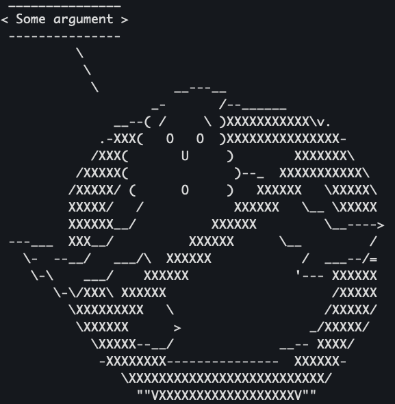
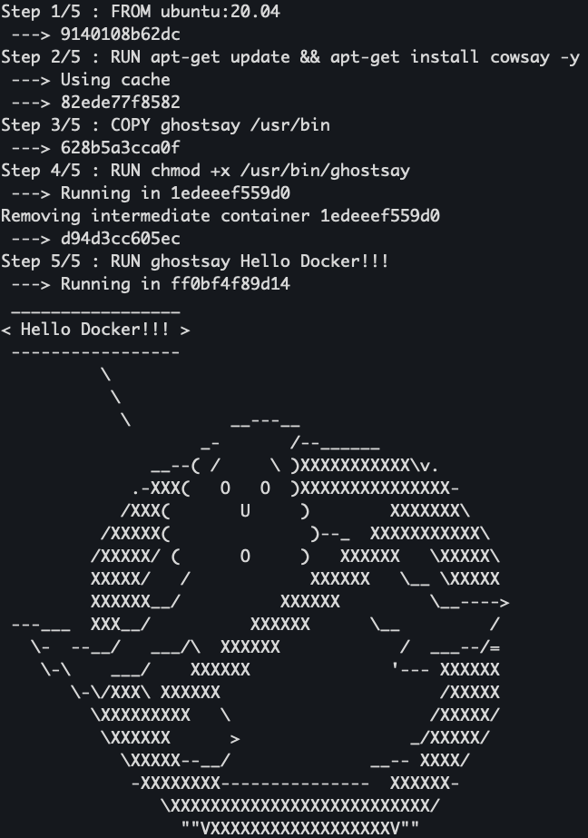

# Ghostsay
> Generate an ASCII image of a Ghostbusters logo with a message in a Docker container (Just a Dockerfile test).


```sh
$ docker run ghostsay:1.0 ghostsay Some argument
```


## Installation

Docker:
> In ghostsay directory:
```sh
docker build -t ghostsay:1.0 .
```

